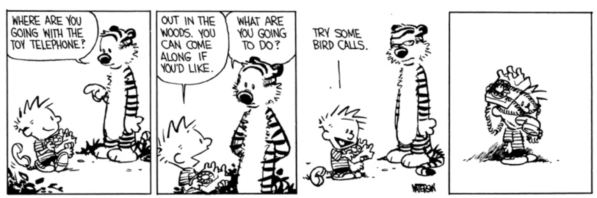

# Image Splitting Tool

# Image Splitter

Image Splitter is a desktop tool for splitting comic strip images (or any image) into individual frames or sections. It provides an interactive GUI for drawing lines or boxes to define the split regions, and supports batch processing, undo, and more. A sample comic is shown below for clarity



## Features

- **Interactive GUI**: Draw lines or boxes to define split regions.
- **Supports PNG, JPG, and more**: Works with most common image formats.
- **Undo/Redo**: Easily remove or restore split regions.
- **Batch Processing**: Quickly move to the next image in a folder.
- **Save to Subfolder**: Optionally save split images to a subfolder.
- **Keyboard Shortcuts**: Fast workflow for power users.

## Usage

1. Launch the app:
	```sh
	uv run main.py
	```
2. Use the mouse to draw lines or boxes to define the comic frames.
3. Click **Save Subsections** to export each frame as a separate image.
4. Use the **Switch to Box/Line Mode** button to toggle between splitting modes.
5. Use keyboard shortcuts for faster workflow (see below).

## Keyboard Shortcuts

| Key         | Action                        |
|-------------|-------------------------------|
| Q / E       | Load previous/next image      |
| W           | Delete current image          |
| T           | Trim bounds                   |
| U           | Restore from recycle bin      |
| A           | Auto-draw (auto split)        |
| B           | Toggle box/line mode          |
| P           | Open image in MS Paint        |
| S           | Add grid                      |
| K           | Toggle keep polygons          |
| V           | Toggle polygon view           |
| C           | Crop or save                  |
| Esc         | Clear all polygons            |
| G           | Focus grid entry              |
| R           | Reset                         |
| Enter       | Save                          |
| F2          | Rename image                  |
| Backspace   | Delete last polygon           |

## Build

Build with `uv run cxfreeze build`

## License

MIT License
